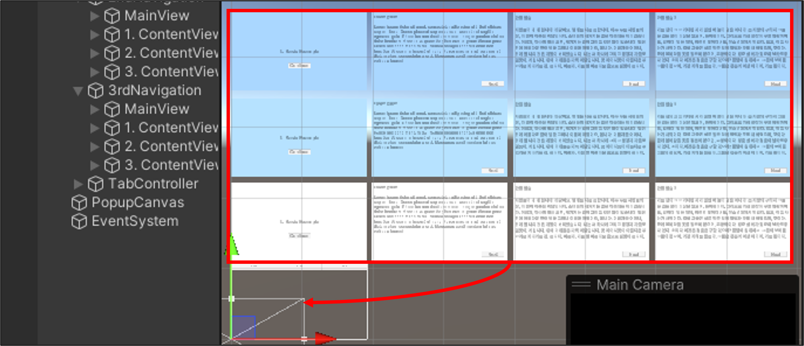
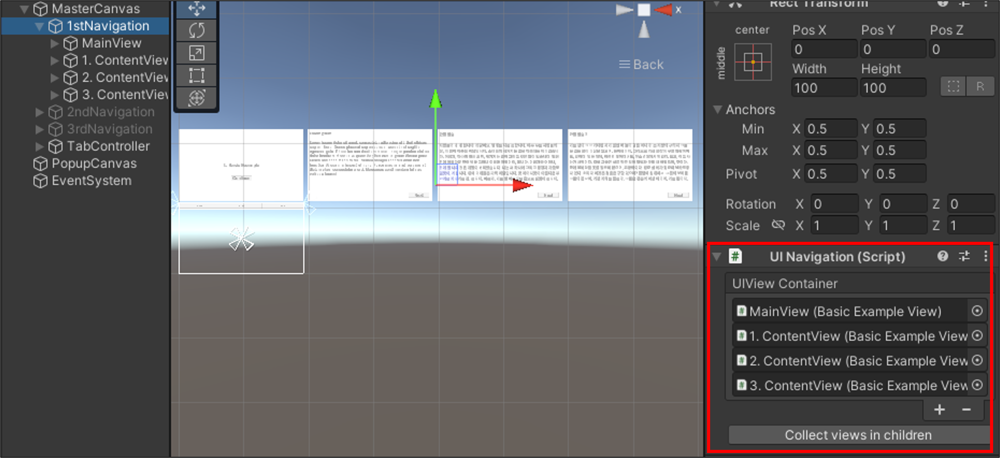
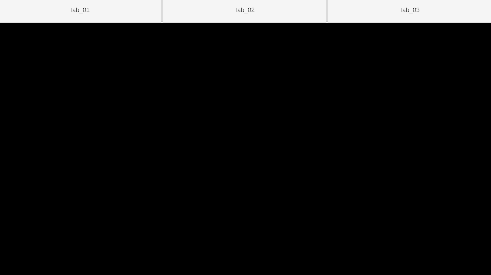
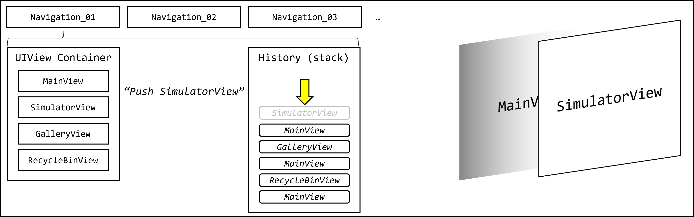
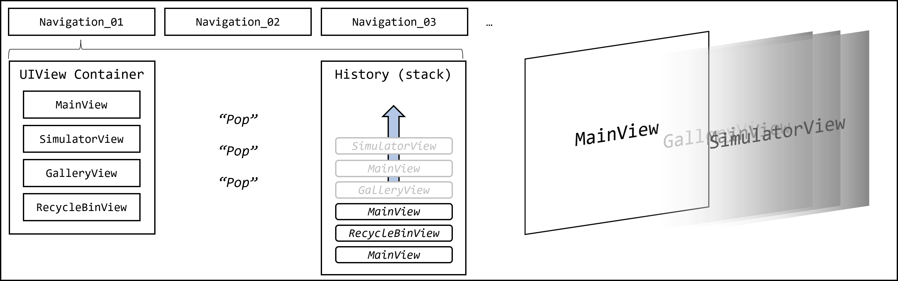
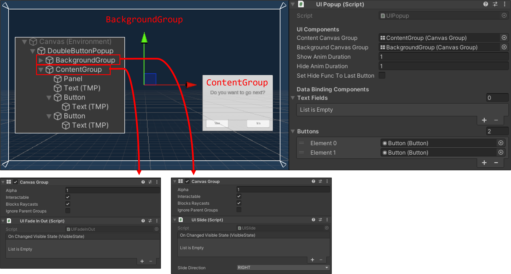

# UI Navigation

## 목적

디자이너와 개발자의 협업과 Unity상 Scene 충돌 방지를 최소화하기 위해, 개발되었습니다. 더불어, 사용자에게 친화적인 인터페이스를 제공을 목적으로 하고 있습니다.

## 요약

여러분들은 자유롭게 View를 배치하여 작업할 수 있습니다. Playmode에서는 Navigation이 작업된 View를 수집하여, 동작할 것입니다.



UI Navigation이 관리할 UIView들을 자식으로 두길 권장합니다. 배치 후, Editor 버튼으로 쉽게 UIView를 수집할 수 있습니다.



UIView 마다, 다양한 Animation을 적용시킬 수 있습니다. 또한, 다양한 애니메이션을 조합하여 사용할 수 있습니다.

**PopIn + FadeInOut**



**Only PopIn**


*만약, UIView에 별도 애니메이션 (UITransition)이 없다면, FadeInOut을 사용합니다.*

더불어, 애니메이션은 UIPopup에서도 동일하게 동작합니다.

## 설치

1. 몇 가지 플러그인에 Dependency가 존재하므로, 중복되지 않는지 확인하시길 바랍니다.

**사용된 플러그인**

| name    | url                                | version |
|---------|------------------------------------|---------|
| UniRX   | https://github.com/neuecc/UniRx    | 7.1.0   |
| DOTween | https://dotween.demigiant.com/     | 1.2.7   |
| UniTask | https://github.com/Cysharp/UniTask | 2.3.3   |

만약, 플러그인 충돌이 발생한다면 Develop 브랜치의 [Packages](https://github.com/Kunnymann/ui-navigation-method/tree/develop/Packages/ui-navigation-method)를 직접 다운로드 받아, 플래그인들을 수정하시면 됩니다. 추후, .unitypackage 파일을 공유하겠습니다.

2. Editor에서 Window/Package Manager를 선택하여, Package Manager 윈도우를 엽니다.
3. *Add package from git URL...*을 선택하고, git url (https://github.com/Kunnymann/ui-navigation-method.git)을 입력합니다.
4. Sample을 import하면 예제를 확인할 수 있습니다.

## 구성

### UIView

UIView는 특정 맥락의 Scene내에서 보여질 UI들을 일괄적으로 보여주는 단위 화면입니다. 전술하였듯, UIView는 Playmode의 화면에서 사라진 상태 (Hide)에서 시작하고, 부모 캔버스의 정중앙 위치로 이동하는 초기화 과정을 수행합니다.

UIView는 CanvasGroup를 Component로 갖고 있어야 하며, UIView 클래스를 상속받아 기능을 구현하길 권장합니다. 

```csharp
using UnityEngine;
using UnityEngine.UI;
using TMPro;
using uinavigation.uiview;

public class ExampleView : UIView
{
    [Header("Login Form")]
    [SerializeField] private TMP_InputField _idInputField;
    [SerializeField] private Button _loginButton;

    protected override void Start()
    {
        base.Start();
    }

    private void OnClickLogin()
    {
        PlayerPrefs.SetString(MyRoomConst.PLAYER_ID, _idInputField.text);
        SplashManager.Instance.JoinMyRoom();
    }

    protected override void OnHide()
    {
        // 해당 UIView의 Animation Duration이 0이면, 애니메이션 없이 바로 Hide가 실행되므로, OnHide에서 이벤트 삭제를 검토한다.
        if (_loginButton.onClick.GetPersistentEventCount() > 0)
            _loginButton.onClick.RemoveListener(OnClickLogin);
    }

    protected override void OnHiding()
    {
        _loginButton.onClick.RemoveListener(OnClickLogin);
    }

    protected override void OnShow()
    {
        _loginButton.onClick.AddListener(OnClickLogin);
    }
}    
```

### UINavigation

UINavigation을 통해, Scene내 View를 제어할 수 있습니다. 사용자가 접근한 View들의 히스토리를 추적하며, 이 구조는 *Stack* 구조로 되어 관리됩니다. UINavigation의 Push, Pop 기능을 사용하여, UIView를 호출하거나 바꾸는 것이 가능합니다.

**Push**



**Pop**



```csharp
using UnityEngine;
using uinavigation;

[RequireComponent(typeof(UINavigation))]
public class SceneManager : MonoBehaviour
{
    private UINavigation _uiNavigation;

    private void Awake()
    {
        _uiNavigation = GetComponent;
    }

    private void Start()
    {
        // 파라미터는 UIView의 gameObject.name를 사용.
        // 그러나, 해당 UIView는 UINavigation의 UIViewContainer에 등록된 상태여야함.
        _uiNavigation.PushUIView("MainView");
    }

    ...

    private void OnBackwardButton()
    {
        _uiNavigation.PopUIView();
    }
}
```

UINavigation은 내부에 *UIViewContainer*를 보유하고 있습니다. Editor를 통해, 컨테이너에 UIView를 등록할 수 있습니다.
등록된 UIView는 해당 Navigation을 통해, 제어할 수 있습니다.

### UIContextManager

현재 Scene내 UINavigation들을 수집합니다. Scene이 파괴될 때, UINavigation과 DOTween 등을 Dispose합니다.

### UIPopup

**UIPopup**은 팝업 인터페이스입니다. 일반 인터페이스보다 팝업이 항상 위에 있으므로, UIView가 사용되는 Canvas보다 *Sort Order*가 높은 Canvas를 사용하길 권장합니다. 또한, UIPopup은 UIView와 다르게, **UIPopupContainer**에 등록된 *Prefab*을 생성하여 동작합니다.

UIPopup에는 **Popup content 영역**과 **Background 영역**으로 나누어집니다. 또한, 이들은 모두 *CanvasGroup Component*를 갖고 있어야 하며, *UITransitionBase*를 사용하여 애니메이션을 가질 수 있습니다. 없다면 런타임에 동적으로 *UITransitionFadeInOut*이 부착됩니다.

물론, Background가 필요하지 않는 Popup Prefab에는 Background를 만들 필요가 없습니다.



UIPopup 내, **UI Components** 항목의 데이터 (기본 Text, Button)를 Binding 할 수 있습니다. 제공되는 확장 메소드를 통해, 아래와 같이 Text 내용과 Button에 이벤트를 부착할 수 있습니다.

```csharp
// UIPopup을 호출하는 일반 스크립트나 UIView 스크립트

var popUp = UIPopup.GetUIPopup("DoubleButtonPopup");

    popUp.SetText("다음 가이드를 보시겠습니까?", "네, 볼래요!", "아니요, 안 볼래요!") // 팝업 내용, Confirm 버튼, Cancel 버튼
        .SetDependencyOnView(UINavigation.CurrentView) // 해당 UIView에 Lifecycle에 따름 (Hide시, Hide됨)
        .SetButtonEvent(async () =>
        {
            await popUp.Hide(); // Confirm 버튼 이벤트. 해당 Popup을 Hide하고, 다음 UIView를 보여줌.
            UINavigation.PushUIView(guideViewObject.transform.parent.GetChild(nextGameObjectIndex).name);
        }, async () => 
        {
            await popUp.Hide()) // Cancel 버튼 이벤트. 해당 Popup만 Hide함.
        }
        .Show().Forget();
```

Editor의 *Set Hide Func To Last Button*는 마지막 Index의 Button에 자동적으로 Hide를 실행하는 이벤트를 부착시키는 옵션입니다.

### UIPopupContainer

**UIPopupContainer**는 UIPopup Prefab을 관리하는 Behaviour입니다. Popup Canvas에 부착되어야 하며, 확장 메소드를 통해서 등록된 Prefab의 gameObject.name으로 호출할 수 있습니다.

### UITransitionBase

UIView와 UIPopup의 애니메이션으로 사용됩니다. 별도의 할당이 없다면 *UITransitionFadeInOut*을 자동 할당합니다. 또한, UITransitionBase를 1개 이상을 가질 수 있으므로, 여러 UITransitionBase를 조합하여 다양한 애니메이션을 부여할 수 있습니다.

필요하다면, 상속받아 새로운 애니메이션을 구현할 수 있습니다.

```csharp
using UnityEngine;
using uinavigation;
using Cysharp.Threading.Tasks;

public class ExampleAnimation : UITransitionBase
{
    protected override UniTask HideAnim(float duration)
    {
        // UIView나 UIPopup이 애니메이션을 통해 숨겨지는 경우
    }

    protected override void HideWithoutAnim()
    {
        // UIView나 UIPopup이 별도 애니메이션 없이 숨겨지는 경우
    }

    protected override void KillAnim()
    {
        // 애니메이션 중단
    }

    protected override UniTask ShowAnim(float duration)
    {
        // UIView나 UIPopup이 애니메이션을 통해 나타나는 경우
    }

    protected override void ShowWithoutAnim()
    {
        // UIView나 UIPopup이 별도 애니메이션 없이 나타나는 경우
    }
}
```

### License

This package is under the MIT License.